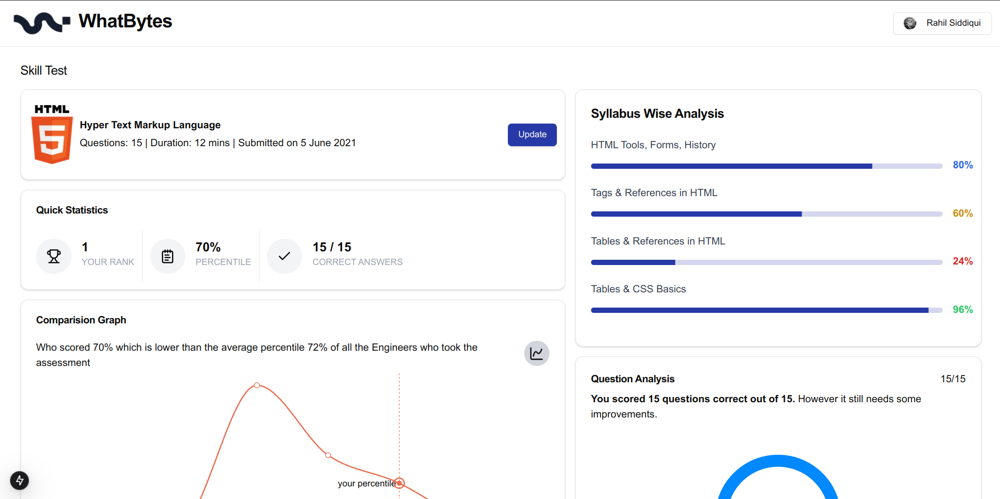

# Skill Assessment Dashboard

A modern, interactive dashboard built with Next.js and TypeScript for visualizing and managing skill assessment results. This project demonstrates proficiency in modern web development technologies and best practices.


## 🚀 Key Features

- **Interactive Data Visualization**
  - Dynamic pie charts showing assessment scores
  - Comparative line charts for percentile analysis
  - Real-time progress indicators
  - Syllabus-wise analysis with color-coded progress bars

- **Modern UI Components**
  - Responsive card layouts
  - Accessible dialog modals for data updates
  - Custom tooltips and interactive elements
  - Animated progress indicators

- **State Management**
  - Real-time score updates
  - Dynamic percentile calculations
  - Interactive data modifications

- **Accessibility**
  - ARIA labels and roles
  - Keyboard navigation support
  - Screen reader compatibility
  - Focus management

## 🛠️ Technologies Used

### Core
- [Next.js 15.1](https://nextjs.org/) - React Framework
- [TypeScript](https://www.typescriptlang.org/) - Type Safety

### UI Components & Styling
- [TailwindCSS](https://tailwindcss.com/) - Utility-first CSS
- [Shadcn/ui](https://ui.shadcn.com/) - UI Component Library
- [Radix UI](https://www.radix-ui.com/) - Headless UI Components
- [Lucide Icons](https://lucide.dev/) - Icon Library

### Data Visualization
- [Recharts](https://recharts.org/) - Composable charting library

## 📊 Dashboard Features

1. **Score Analysis**
   - Overall score display
   - Percentile comparison
   - Rank tracking
   - Performance metrics

2. **Visual Representations**
   - Pie charts for score distribution
   - Line charts for comparative analysis
   - Progress bars for syllabus coverage

3. **Interactive Updates**
   - Real-time score modifications
   - Dynamic rank updates
   - Percentile recalculations

## 🚀 Getting Started

1. Clone the repository:

```bash
git clone https://github.com/mucchu/dashboard.git
cd dashboard
```
```bash
pnpm install
pnpm dev
```
```src/
├── app/ # Next.js app directory
│ ├── components/ # React components
│ │ ├── navbar.tsx # Navigation component
│ │ ├── pie_chart.tsx # Chart components
│ │ └── subanalysis.tsx # Analysis components
│ ├── layout.tsx # Root layout
│ └── page.tsx # Main dashboard page
├── components/ # Shared UI components
│ └── ui/ # Shadcn UI components
│ ├── button.tsx
│ ├── card.tsx
│ ├── progress.tsx
│ └── ...
└── lib/ # Utility functions
└── utils.ts # Helper functions
```

## 🎯 Learning Outcomes

- **Modern React/Next.js Development**
  - App Router implementation
  - Server and Client Components
  - TypeScript integration
  - Performance optimization

- **UI/UX Development**
  - Component-based architecture
  - Responsive design patterns
  - Accessibility implementation

- **Data Visualization**
  - Chart implementation using Recharts
  - Real-time data updates
  - Interactive visualizations
  - Performance optimization

- **Best Practices**
  - Clean code architecture
  - DRY principles
  - Type safety
  - Code splitting
  - Performance optimization

## 🔍 Key Implementation Details

- **Performance**
  - Image optimization
  - Code splitting
  - Dynamic imports
  - Memoization where necessary

- **Testing**
  - Component testing setup
  - Accessibility testing
  - Cross-browser testing
  - Responsive design testing


## 🙏 Acknowledgments

- [Next.js Documentation](https://nextjs.org/docs)
- [Shadcn/ui Components](https://ui.shadcn.com)
- [Recharts Library](https://recharts.org)
- [TailwindCSS](https://tailwindcss.com)

